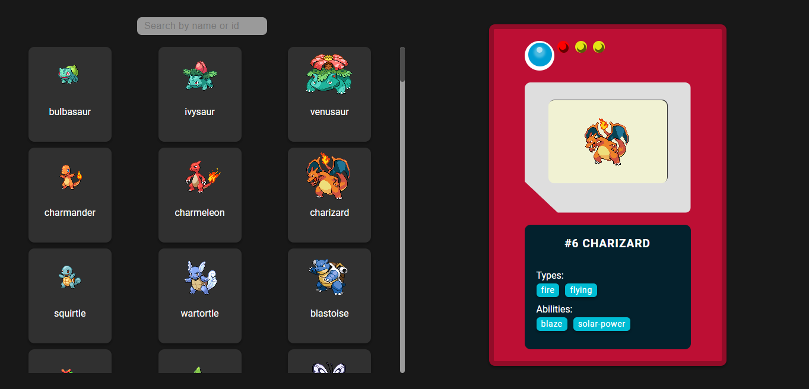

# Technical Test | Pokédex

to see the project you can go to:
[ir al sitio](pokedex-jhonangulo.vercel.app/)



## Instructions to run locally

First, install dependencies:

```bash
npm i
```

then you can use the command for development:

```bash
npm run dev
```

to compile use:

```bash
npm run build
```

and for production: 

```bash
npm start
```

## Requirements

1. List all Pokémon, provide some kind of pagination feature (Infinite Scroll preferred).
2. View a Pokémon detailed info (Image, id, name, type, abilities).
3. Search for a specific Pokémon (this feature is not established on the wire frame but find the best location to place it).


## Technologies used

1. Next.js
2. Redux
3. Redux-Saga
4. Sass
5. Hooks


### Api used
> https://pokeapi.co/